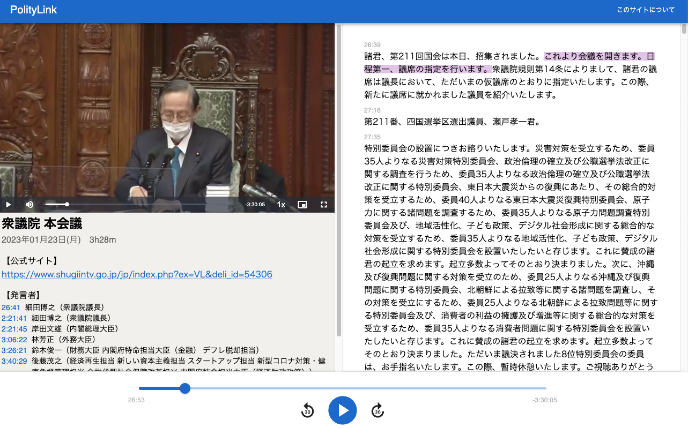

# PolityLink

[日本語版 README はこちら](./README.md)

## What is PolityLink?

[PolityLink](https://politylink.jp/) is a website that can play Japanese Diet broadcasts with transcripts.
With the transcription auto-generated within 24 hours of the public release of the broadcasts, 
PolityLink helps users to stay up-to-date on the topics being discussed in the Diet.

## How PolityLink works

PolityLink consists of the following components:

* Crawler: retrieves new videos from the deliberation streaming sites ([House of Representatives](https://www.shugiintv.go.jp/index.php) and [House of Councillors](https://www.webtv.sangiin.go.jp/webtv/index.php))
* Builder: automatically transcribe with [whisper.cpp](https://github.com/ggerganov/whisper.cpp) and generates page data for the frontend
* Frontend: build and deploys pages using [Gatsby](https://www.gatsbyjs.com/)

For more details about the crawler and builder, please see [builder](./builder), 
and for more details about the frontend, please see [frontend](./frontend).